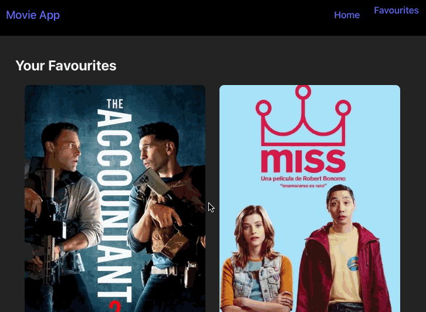

npm run dev# 🎬 Movie Explorer

A modern React app to browse, search, and favorite movies using [The Movie Database (TMDB)](https://www.themoviedb.org/) API.  
Easily discover trending films, search by title, and manage your personal favorites list.



## Notes:
This project uses the TMDB API. The API key is included for demo purposes.
Favorites are stored in your browser's localStorage.
For any issues or suggestions, feel free to open an issue or PR!
---

## ✨ Features

- 🔍 **Search** for movies by title
- 🌟 **Browse** popular movies from TMDB
- ❤️ **Add/remove** movies to your favorites (saved in your browser)
- 🎨 Responsive, clean UI with React and CSS Grid
- ⚡ Built with [Vite](https://vitejs.dev/) for fast development

---

## 🚀 Getting Started

### 1. Clone the repository

```sh
git clone https://github.com/Digital-inspiration/movie-explorer.git
cd movie-explorer
### 2. Install dependencies
npm install
### 3. Start the development server
npm run dev
```

The app will be available at http://localhost:5173.

## Available Scripts
npm run dev – Start the development server
npm run build – Build for production

## License
MIT

Enjoy exploring movies!